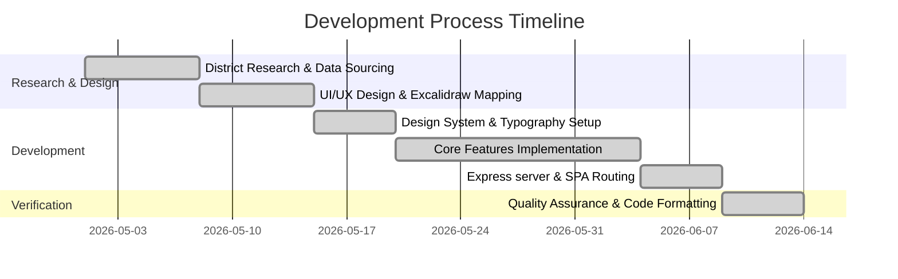
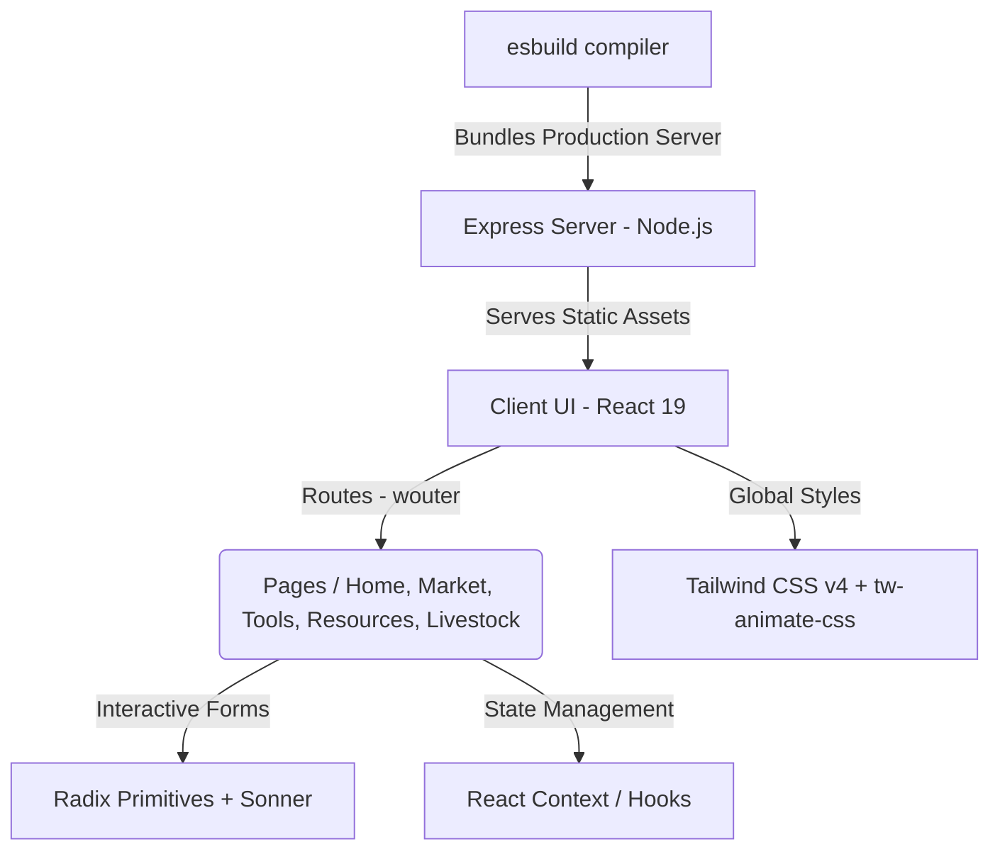

# 🌾 AgriLink Sierra — Smart Farming Platform

AgriLink Sierra is a coordinating digital platform designed to bridge the information gap for smallholder farmers, agricultural buyers, and extension leads across all **16 districts of Sierra Leone**.

Built with an editorial **"Tropical Modernism"** design system, the platform puts critical agricultural resources directly in the hands of the farming community—providing real-time market pricing, localized weather alerts, diagnostic utilities, and machinery directories.

---

## 🎯 Background & Purpose: Why AgriLink Sierra Was Built

Agriculture is the backbone of Sierra Leone's economy, employing over 60% of the population and contributing significantly to the national GDP. However, smallholder farmers—who form the majority of the agricultural workforce—face severe structural, environmental, and informational hurdles:

1. **Information Asymmetry & Middleman Exploitation:** Due to a lack of transparent, centralized market pricing data, farmers in districts like Kailahun, Kono, or Tonkolili often sell their hard-earned yields to middlemen at heavily discounted prices, missing out on fair market value.
2. **Climate Uncertainty:** With changing rainfall profiles in West Africa, traditional farming schedules are becoming less reliable. Farmers lack accurate, localized weather forecasting and data-driven crop calendars.
3. **Pest & Disease Devastation:** Fungal infections and pests (such as the Fall Armyworm or Cassava Mosaic Virus) can destroy up to 40% of seasonal yields. In rural zones, there is a severe shortage of agricultural extension officers to diagnose and provide treatment suggestions in real time.
4. **Access to Heavy Machinery:** Smallholders are often constrained to manual tools, leading to low productivity. Meanwhile, machinery rental and wholesale buyer resources remain fragmented and inaccessible.
5. **Financial Vulnerability:** Lack of financial tools makes it difficult for farmers to estimate production costs (such as seeds, fertilizer, and labor) versus expected yield revenue, leading to high-risk investments.

**AgriLink Sierra** was built to address these challenges directly. It serves as a digital bridge, putting real-time, actionable insights directly into the hands of farmers, buyers, and extension leads across all 16 districts.

---

## 🌾 What AgriLink Sierra Brings to Sierra Leonean Farmers

By democratizing access to agricultural technology and data, the platform empowers the local farming ecosystem in several key ways:

- **Empowers Price Negotiation:** With the **Live Market Price Dashboard**, farmers can check real-time crop values across Bo, Kenema, Makeni, and Freetown markets. This transparency shifts the bargaining power back to the farmers, preventing middleman exploitation.
- **Enables Climate-Smart Farming:** Localized weather dashboards paired with district-specific agricultural advice translate weather data (like humidity, rain percentage, and UV index) into actionable daily advice (e.g., "Good day for transplanting, skip irrigation").
- **Protects Crops & Maximizes Yield:** The offline-ready **Disease Diagnostic Guide** acts as a virtual extension officer. Farmers can diagnose symptoms instantly, learn immediate treatments, and take preventative measures before a disease spreads.
- **Facilitates Financial Literacy:** The **Farm Calculator** helps farmers plan seasonal budgets. By knowing their estimated ROI and break-even thresholds beforehand, they can make informed financial investments and scale their operations securely.
- **Optimizes Resource Utilization & Scale:** Through the **Livestock Logs** and **Wholesaler & Machinery Rental Directories**, farmers can schedule vaccines, manage feeding schedules, rent tractors or harvesters, and directly contact bulk buyers, raising the overall productivity of rural communities.

---

## 🛤️ Implementation Journey: Steps Taken to Achieve This

Building a platform tailored to the unique socio-economic landscape of Sierra Leone required a structured, user-centric engineering process:



### 1. Research & District Sourcing

We researched crop statistics, regional pricing variations, and seasonal schedules specific to Sierra Leone's 14 rural districts. We defined a baseline dataset for 11 staple crop prices across major markets (Bo, Kenema, Makeni, Freetown) and compiled feeding and vaccination guidelines for common local livestock (Cattle, Goats, Sheep, Poultry, Pigs).

### 2. UI/UX Wireframing in Excalidraw

To ensure ease of use for smallholders and extension officers, we mapped responsive interface wireframes. We established two distinct layouts (`desktop view.excalidraw` and `Phone and Tablet View.excalidraw`) to handle scaling requirements from low-end mobile devices to desktop monitors.

### 3. Styling & "Tropical Modernism" Design System

We implemented a custom design theme in [`index.css`](file:///c:/Users/LENOVO/Downloads/agrilink-sierra/client/src/index.css) utilizing modern HSL/oklch colors. By matching deep forest greens with warm harvest golds, we established a premium visual identity representing Sierra Leone's agricultural growth. We used custom typography (Sora and Nunito Sans) for high readability.

### 4. Interactive Feature Engineering

We developed the core React 19 pages (`Home.tsx`, `Market.tsx`, `Tools.tsx`, `Resources.tsx`, `Livestock.tsx`) containing interactive business logic:

- Dynamic calculators with instant mathematical computations for ROI and break-even points.
- Search filters and category toggles for crop databases and market sheets.
- Interactive modals and collapsible cards for crop schedules and livestock logs.

### 5. Backend Server & Bundling

We configured an Express host to serve production assets with a catch-all router to support client-side SPA routing cleanly. We set up `esbuild` to compile server entry points dynamically.

### 6. Validation & Quality Checks

Finally, we performed static typechecking via `tsc --noEmit` and formatted the entire codebase with Prettier to maintain a clean, maintainable structure for future open-source contributors.

---

## 🎨 Design & Wireframing (Excalidraw)

> [!NOTE]  
> All UI/UX wireframes and layout designs for AgriLink Sierra were brainstormed and modeled using **Excalidraw**. The raw design files are included directly in the root of the repository, enabling developers to easily load and customize the visual design.

- **Desktop Layout:** [`desktop view.excalidraw`](file:///c:/Users/LENOVO/Downloads/agrilink-sierra/desktop%20view.excalidraw)
  - _Quick Preview:_ Check out the exported PNG diagrams [`desktop_view.png`](file:///c:/Users/LENOVO/Downloads/agrilink-sierra/desktop_view.png) and [`desktop_view(2).png`](<file:///c:/Users/LENOVO/Downloads/agrilink-sierra/desktop_view(2).png>) to see the high-fidelity mockups.
- **Mobile & Tablet Layout:** [`Phone and Tablet View.excalidraw`](file:///c:/Users/LENOVO/Downloads/agrilink-sierra/Phone%20and%20Tablet%20View.excalidraw)

### 💡 How to View or Modify Wireframes:

1. Navigate to the online canvas at [Excalidraw](https://excalidraw.com/).
2. Click the **Open...** folder icon or drag-and-drop either of the `.excalidraw` files onto the canvas.
3. You will have full access to inspect components, modify spacing, and export revised mockups.

---

## 🚀 Key Modules & Features

The platform is structured into modular sections, each catering to specific agricultural needs:

### 1. Market Intelligence Dashboard

- **Core Component:** [`MarketSection.tsx`](file:///c:/Users/LENOVO/Downloads/agrilink-sierra/client/src/components/sections/MarketSection.tsx)
- **Logic:** Tracks daily crop pricing indices for 11 key agricultural staple items (Rice, Cassava, Maize, Palm Oil, Cocoa, Coffee, Groundnuts, Sweet Potatoes, Tomatoes, Onions, and Pepper) across major regional markets (Bo, Kenema, Makeni, Kailahun, Kono, Tonkolili, Moyamba, and Freetown).
- **Aesthetics:** Implements trend indicators (rising/falling/neutral) with automated percentage shift calculations to help prevent buyer exploitation in remote areas.

### 2. Localized Agricultural Weather Alerts

- **Core Component:** [`WeatherSection.tsx`](file:///c:/Users/LENOVO/Downloads/agrilink-sierra/client/src/components/sections/WeatherSection.tsx)
- **Logic:** Displays real-time temperatures, humidity levels, wind speed, UV indices, and rainfall metrics for Freetown, Bo, Kenema, Makeni, Koidu, and Moyamba.
- **Smart Advisories:** Generates context-aware farming recommendations based on weather parameters (e.g., advising whether it is a good day for applying fertilizer, weeding, or transplanting seedlings).
- **Forecasts:** Includes a 7-day weather outlook to support long-term planning.

### 3. Seasonal Crop Calendars & Advisors

- **Core Component:** [`CropAdvisorySection.tsx`](file:///c:/Users/LENOVO/Downloads/agrilink-sierra/client/src/components/sections/CropAdvisorySection.tsx)
- **Logic:** Contains interactive modals detailing detailed growing parameters: soil preparation, planting guidelines, fertilization schedules (NPK/Urea dosages), expected yields, and market demand stats for Sierra Leone’s staple foods.

### 4. Interactive Farm Calculator & Budgeter

- **Core Component:** [`CalculatorSection.tsx`](file:///c:/Users/LENOVO/Downloads/agrilink-sierra/client/src/components/sections/CalculatorSection.tsx)
- **Logic:** Built-in financial planning spreadsheet where farmers input their farm size (hectares), crop selection, expected yield, and market price to calculate:
  - **Estimated Revenue** (SLL / Leones)
  - **Production Costs** (using structured default cost sheets)
  - **Net Profit/Loss**
  - **Return on Investment (ROI)** percentage
  - **Break-even Yield** (kg needed to cover costs)

### 5. Low-Connectivity Disease Diagnostics

- **Core Component:** [`DiseaseSection.tsx`](file:///c:/Users/LENOVO/Downloads/agrilink-sierra/client/src/components/sections/DiseaseSection.tsx)
- **Logic:** Designed as an offline-first diagnostic directory. Extension leads or farmers select their crop and select visible symptoms to immediately receive disease identification (e.g., Rice Yellow Mottle Virus, Cassava Mosaic Disease, Fall Armyworm, Tomato Bacterial Wilt), severity levels, direct treatments, and crop prevention instructions.

### 6. Livestock Tracking & Wholesaler Marketplace

- **Livestock Component:** [`LivestockSection.tsx`](file:///c:/Users/LENOVO/Downloads/agrilink-sierra/client/src/components/sections/LivestockSection.tsx)
  - _Features:_ Manage logs for Cattle, Goats, Sheep, Poultry, and Pigs. Tracks feeding guidelines, expected body weights, and vaccination schedules (e.g., Newcastle, PPR, Swine Fever, Anthrax).
- **Marketplace Component:** [`MarketplaceSection.tsx`](file:///c:/Users/LENOVO/Downloads/agrilink-sierra/client/src/components/sections/MarketplaceSection.tsx)
  - _Features:_ A buyer/seller directory facilitating connections with verified agricultural wholesalers, heavy machinery rentals (tractors, power tillers, threshers), and transport services.

---

## 🎨 Design System: "Tropical Modernism"

The application adheres to an Afro-futurist editorial design system that combines organic aesthetics with clean, data-forward tech dashboards.

- **Primary (Forest Green):** `oklch(0.42 0.14 145)` / `#2E7D32` — Authority, organic growth, and crop life.
- **Secondary (Vibrant Green):** `oklch(0.55 0.16 145)` / `#4CAF50` — Leaf vitality and active UI states.
- **Accent (Amber Gold):** `oklch(0.82 0.17 85)` / `#FFC107` — Represents harvest, sun, warmth, and high-visibility CTAs.
- **Background (Soft Green Tint):** `oklch(0.99 0.005 145)` / `#F8FFF8` — A clean, light-colored background.
- **Dark (Forest Shade):** `oklch(0.18 0.04 145)` / `#1B4332` — Deep green shadow used for cards, headers, and footer backgrounds.
- **Typography:**
  - _Headings:_ **Sora** (Bold, geometric display font with tight `-0.035em` tracking for a premium editorial tone).
  - _Body:_ **Nunito Sans** (Warm, friendly sans-serif optimized for reading long-form text on mobile screens).
- **Interactive Effects:** Diagonal section cuts (`clip-path` polygons), leaf particle animations, glassmorphic panels (`backdrop-filter: blur(20px)`), and scroll-triggered layout transitions.

All design tokens are initialized in the global stylesheet [`index.css`](file:///c:/Users/LENOVO/Downloads/agrilink-sierra/client/src/index.css).

---

## 🛠️ Tech Stack & Architecture



### Frontend (Client)

- **Core Framework:** React 19 + TypeScript + Vite 7
- **Routing:** Wouter (minimalist SPA routing)
- **Animations:** Framer Motion 12 (smooth scroll triggers, accordion reveals, and number count-ups)
- **Components & Icons:** Radix UI primitives + Lucide React icons
- **Styling:** Tailwind CSS v4 using the `@tailwindcss/vite` compiler plugin

### Backend (Server)

- **Core Framework:** Node.js + Express (hosts statically compiled frontend assets and implements a SPA router fallback)
- **Compiler:** Esbuild (compiling TypeScript server files)

---

## 📁 Project Directory Structure

```
agrilink-sierra/
├── client/                     # Frontend React Application
│   ├── public/                 # Static assets (icons, images, leaf models)
│   ├── src/
│   │   ├── components/         # UI Elements & Section Modules
│   │   │   ├── sections/       # Page sections (Hero, Market, Calculators, FAQ)
│   │   │   └── ui/             # Core UI components (button, input, toast)
│   │   ├── contexts/           # Theme and Global Contexts
│   │   ├── hooks/              # Custom utility hooks
│   │   ├── lib/                # Utility classes (tailwind-merge helper)
│   │   ├── pages/              # SPA Pages (Home, Market, Tools, Resources, Livestock)
│   │   ├── App.tsx             # Root router mapping routes to pages
│   │   ├── index.css           # Global stylesheet & Tailwind directives
│   │   └── main.tsx            # Main client entry file
│   └── index.html              # HTML entry point for Vite
├── server/                     # Backend Server Application
│   └── index.ts                # Production Express server setup
├── shared/                     # Shared models & configurations
│   └── const.ts                # Global app constants
├── patches/                    # Package overrides & dependency hotfixes
├── vite.config.ts              # Vite configurations
├── package.json                # NPM scripts and project dependencies
└── tsconfig.json               # TypeScript config
```

---

## 💻 Developer Guide & Getting Started

### Prerequisites

Make sure you have the following installed on your machine:

- [Node.js](https://nodejs.org/) (v18.0.0 or higher)
- [pnpm](https://pnpm.io/) (v10.0.0 or higher) or NPM (v9.0.0 or higher)

### Setup & Installation

Clone the repository, navigate to the project root, and install all dependencies:

```bash
# Install dependencies using pnpm
npx pnpm install
```

### Commands & Scripts Reference

The following commands are configured in the project's [`package.json`](file:///c:/Users/LENOVO/Downloads/agrilink-sierra/package.json):

| Command           | Action             | Description                                                                                                   |
| :---------------- | :----------------- | :------------------------------------------------------------------------------------------------------------ |
| `npx pnpm dev`    | Starts Vite Server | Launches the local dev server at `http://localhost:3000` with hot-module reloading.                           |
| `npx pnpm build`  | Production Build   | Bundles the React client into `/dist/public` & builds the Express server into `/dist/index.js` via `esbuild`. |
| `npx pnpm start`  | Run Production     | Starts the Express server which serves the React client. Runs on `http://localhost:3000`.                     |
| `npx pnpm check`  | Typecheck Code     | Runs the TypeScript Compiler (`tsc --noEmit`) to verify types.                                                |
| `npx pnpm format` | Prettier Code      | Automatically formats code formatting across all files.                                                       |

### Running the App Locally

To start the local developer server:

```bash
npx pnpm dev
```

Open **[http://localhost:3000](http://localhost:3000)** in your browser.

### Building and Serving the Production Stack

To verify production readiness:

```bash
# Compile and package client + server
npx pnpm build

# Boot the Express host
npx pnpm start
```

The application will be served at `http://localhost:3000/`.

---

## 🤝 Contribution Guidelines

- **Responsive Styling:** Always write layouts that are mobile-first, ensuring components scale down smoothly.
- **Design Values:** Adhere to the _Tropical Modernism_ guidelines. Use predefined color tokens in [`index.css`](file:///c:/Users/LENOVO/Downloads/agrilink-sierra/client/src/index.css) instead of arbitrary hex codes.
- **Interactive Components:** Ensure all new modals, drawers, or interactive elements use the animation configurations defined in the global stylesheet.
